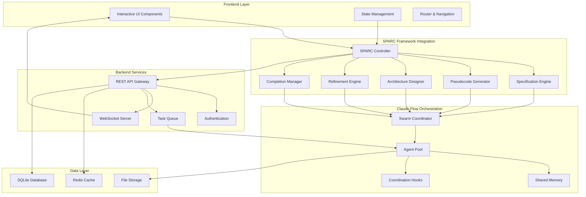

# System Architecture with SPARC Integration

## Overall System Architecture



## Component Architecture Details

### 1. Frontend Architecture

```typescript
// Component Structure
src/
├── components/
│   ├── ExpertiseSelector/
│   │   ├── ExperienceLevel.tsx
│   │   ├── ProjectType.tsx
│   │   └── SPARCConfiguration.tsx
│   ├── WorkflowDisplay/
│   │   ├── PhaseProgress.tsx
│   │   ├── AgentActivity.tsx
│   │   └── OutputPreview.tsx
│   └── shared/
│       ├── CheckboxGroup.tsx
│       ├── ProgressIndicator.tsx
│       └── NotificationSystem.tsx
├── services/
│   ├── api.ts
│   ├── websocket.ts
│   └── sparc-client.ts
├── store/
│   ├── user-preferences.ts
│   ├── workflow-state.ts
│   └── agent-status.ts
└── utils/
    ├── sparc-helpers.ts
    └── validation.ts
```

### 2. SPARC Framework Integration

```javascript
class SPARCController {
  constructor(userConfig) {
    this.phases = {
      specification: new SpecificationEngine(userConfig),
      pseudocode: new PseudocodeGenerator(userConfig),
      architecture: new ArchitectureDesigner(userConfig),
      refinement: new RefinementEngine(userConfig),
      completion: new CompletionManager(userConfig)
    };
  }

  async executePhase(phaseName, input) {
    const phase = this.phases[phaseName];

    // Initialize Claude-Flow swarm for this phase
    const swarmConfig = this.getSwarmConfigForPhase(phaseName);
    const swarmId = await claudeFlow.swarm.init(swarmConfig);

    // Execute phase with coordination
    const result = await phase.execute(input, swarmId);

    // Store results in shared memory
    await claudeFlow.memory.store(`phase/${phaseName}`, result);

    return result;
  }

  getSwarmConfigForPhase(phaseName) {
    const configs = {
      specification: {
        topology: 'hierarchical',
        agents: ['researcher', 'analyst', 'planner'],
        maxAgents: 3
      },
      pseudocode: {
        topology: 'mesh',
        agents: ['coder', 'reviewer'],
        maxAgents: 2
      },
      architecture: {
        topology: 'star',
        agents: ['system-architect', 'reviewer', 'optimizer'],
        maxAgents: 4
      },
      refinement: {
        topology: 'mesh',
        agents: ['coder', 'tester', 'reviewer'],
        maxAgents: 5
      },
      completion: {
        topology: 'hierarchical',
        agents: ['coordinator', 'tester', 'documenter'],
        maxAgents: 3
      }
    };

    return configs[phaseName];
  }
}
```

### 3. Claude-Flow Integration Points

```javascript
// Coordination Hooks Integration
class CoordinationManager {
  async initializeWorkflow(userConfig) {
    // Pre-task hook
    await this.executeHook('pre-task', {
      description: `SPARC workflow for ${userConfig.projectType}`,
      userLevel: userConfig.experienceLevel
    });

    // Setup swarm based on project complexity
    const topology = this.selectTopology(userConfig);
    const swarmId = await claudeFlow.swarm.init({
      topology,
      maxAgents: this.calculateMaxAgents(userConfig),
      strategy: 'adaptive'
    });

    return swarmId;
  }

  async executePhaseWithCoordination(phase, input, swarmId) {
    // Phase-specific agent spawning
    const agents = await this.spawnPhaseAgents(phase, swarmId);

    // Execute with real-time coordination
    const results = await Promise.all(
      agents.map(agent => this.executeWithAgent(agent, input))
    );

    // Post-edit hooks for each output
    await Promise.all(
      results.map((result, index) =>
        this.executeHook('post-edit', {
          file: result.outputPath,
          memoryKey: `swarm/${agents[index].type}/${phase}`
        })
      )
    );

    return this.aggregateResults(results);
  }

  selectTopology(userConfig) {
    if (userConfig.experienceLevel === 'beginner') {
      return 'hierarchical'; // More guided approach
    } else if (userConfig.projectComplexity === 'high') {
      return 'mesh'; // More collaborative
    } else {
      return 'star'; // Balanced coordination
    }
  }

  calculateMaxAgents(userConfig) {
    const baseAgents = 3;
    const complexityMultiplier = {
      'low': 1,
      'medium': 1.5,
      'high': 2
    };

    return Math.ceil(baseAgents * complexityMultiplier[userConfig.projectComplexity]);
  }
}
```

## Data Flow Architecture

### State Management Flow

```javascript
// Redux-like state management for SPARC workflow
const initialState = {
  userConfig: {
    experienceLevel: null,
    projectType: null,
    selectedPhases: [],
    preferences: {}
  },
  workflow: {
    currentPhase: null,
    phaseResults: {},
    agentStatus: {},
    progress: 0
  },
  ui: {
    loading: false,
    errors: [],
    notifications: []
  }
};

// Actions for state transitions
const actions = {
  SET_USER_CONFIG: 'SET_USER_CONFIG',
  START_PHASE: 'START_PHASE',
  COMPLETE_PHASE: 'COMPLETE_PHASE',
  UPDATE_AGENT_STATUS: 'UPDATE_AGENT_STATUS',
  ADD_NOTIFICATION: 'ADD_NOTIFICATION'
};
```

### Real-time Updates via WebSocket

```javascript
class WorkflowWebSocket {
  constructor(workflowId) {
    this.ws = new WebSocket(`ws://localhost:3000/workflow/${workflowId}`);
    this.setupEventHandlers();
  }

  setupEventHandlers() {
    this.ws.on('phase-started', (data) => {
      store.dispatch({
        type: 'START_PHASE',
        payload: data
      });
    });

    this.ws.on('agent-update', (data) => {
      store.dispatch({
        type: 'UPDATE_AGENT_STATUS',
        payload: data
      });
    });

    this.ws.on('phase-completed', (data) => {
      store.dispatch({
        type: 'COMPLETE_PHASE',
        payload: data
      });
    });
  }
}
```

## Scalability Considerations

### Horizontal Scaling
- Stateless API design for easy horizontal scaling
- Queue-based task distribution
- Shared memory via Redis for multi-instance coordination

### Performance Optimization
- Lazy loading of SPARC phases
- Caching of common workflow patterns
- Progressive enhancement based on user interaction

### Error Handling & Resilience
- Graceful degradation when agents fail
- Automatic retry mechanisms
- User-friendly error messages with recovery options