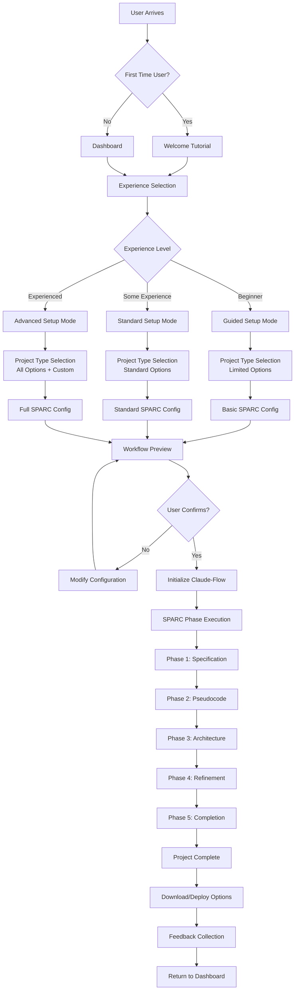
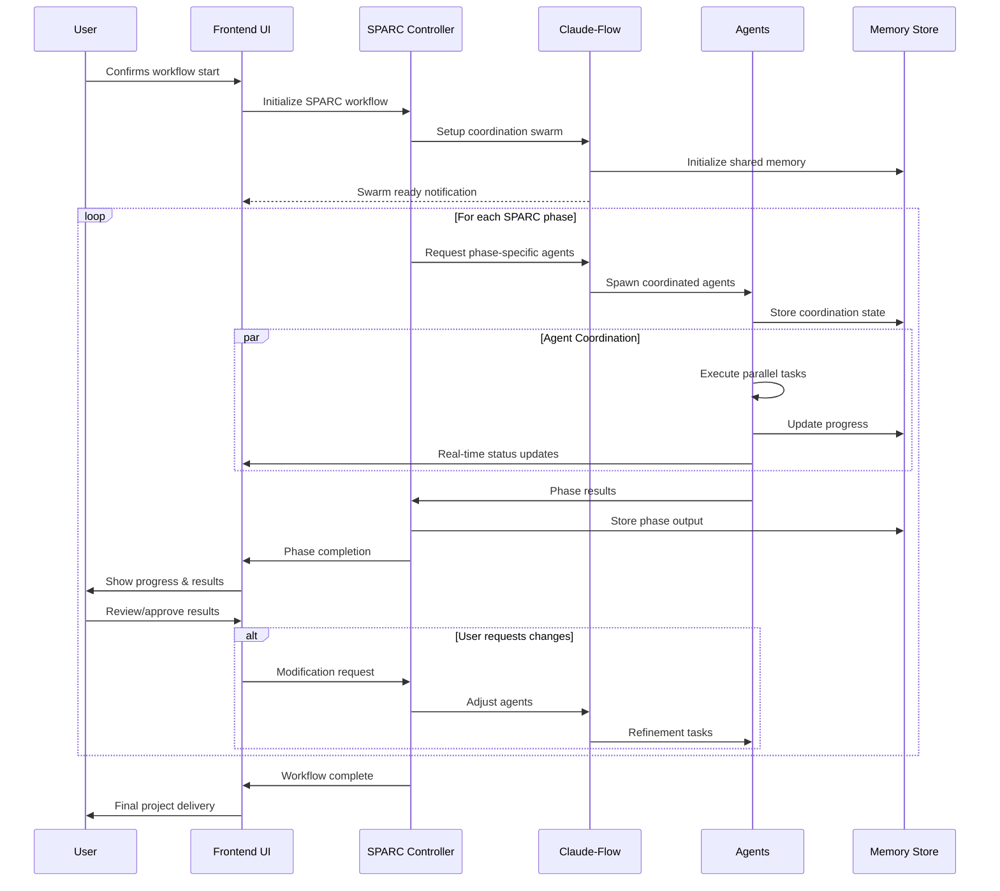
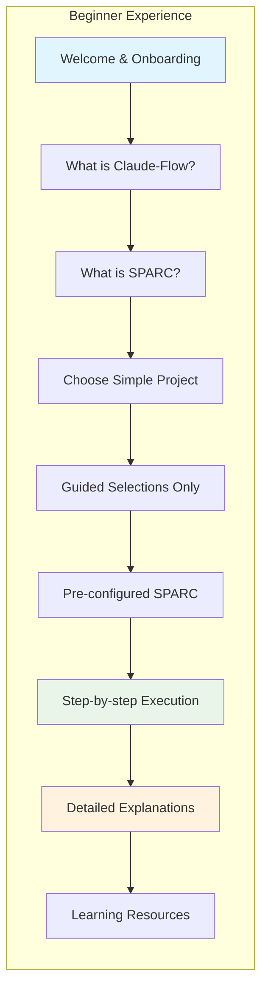
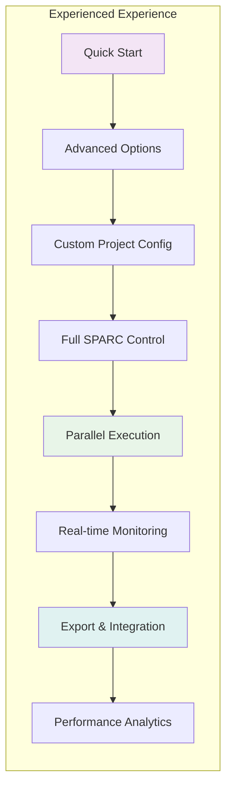
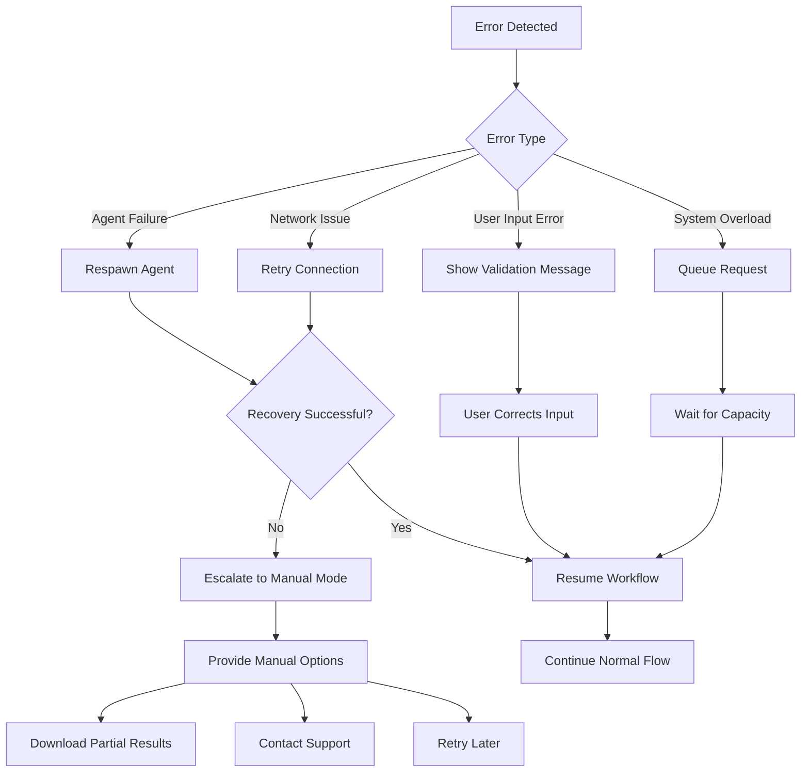
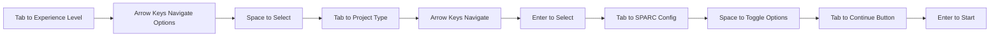
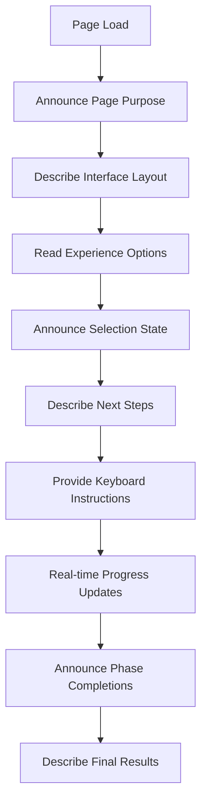
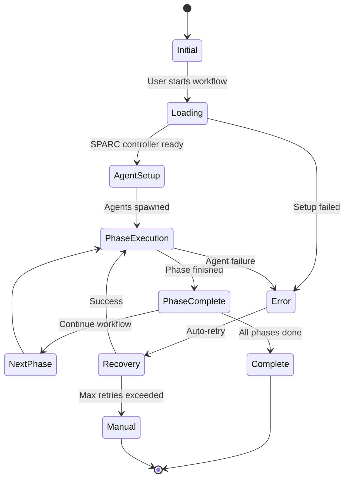

# Detailed User Journey Workflow Diagrams

## Complete User Journey Flow



## Detailed Phase Execution Flow

### Phase Execution Workflow



## Experience-Specific User Paths

### Beginner User Journey



### Experienced User Journey



## Real-time Progress Visualization

### Agent Activity Dashboard

```ascii
┌─────────────────────────────────────────────────────────────┐
│  🚀 Claude-Flow Workflow Progress                          │
├─────────────────────────────────────────────────────────────┤
│                                                             │
│  Current Phase: 📋 Specification (2/5)                    │
│  ████████████████████░░░░░░░░░░░░  60% Complete            │
│                                                             │
│  Active Agents:                                             │
│  ┌─────────────────────────────────────────────────────┐    │
│  │ 🔍 Researcher Agent              [●●●●●○] Working   │    │
│  │   └─ Analyzing user requirements...                 │    │
│  │                                                     │    │
│  │ 📊 Analyst Agent                 [●●●●○○] Idle      │    │
│  │   └─ Waiting for research data...                   │    │
│  │                                                     │    │
│  │ 📝 Planner Agent                 [●●●●●●] Complete  │    │
│  │   └─ Project structure defined ✓                    │    │
│  └─────────────────────────────────────────────────────┘    │
│                                                             │
│  Recent Activity:                                           │
│  • 14:32 - Planner completed project structure             │
│  • 14:28 - Researcher started requirement analysis         │
│  • 14:25 - Phase 1 (Specification) initiated              │
│                                                             │
│  Next: Pseudocode generation with Coder Agent              │
│                                                             │
│  [ Pause ] [ Skip Phase ] [ View Details ] [ Settings ]   │
└─────────────────────────────────────────────────────────────┘
```

## Error Handling & Recovery Flows

### Error Recovery Workflow



## Accessibility & User Experience Flows

### Keyboard Navigation Flow



### Screen Reader Support Flow



## Performance Optimization Flows

### Loading State Management



This comprehensive workflow design ensures a smooth, accessible, and efficient user experience while leveraging the full power of the SPARC framework and Claude-Flow coordination.