# Complete Claude-Flow Beginner Development Setup Guide

**The Essential Guide to Setting Up a Modern AI-Assisted Development Environment**

Welcome to the comprehensive setup guide for Claude-Flow beginners! This guide will take you from zero to a fully functional AI-assisted development environment with Claude-Flow, Claude Code, and all supporting tools.

## 📋 Table of Contents

1. [Overview and Tool Relationships](#overview-and-tool-relationships)
2. [System Requirements](#system-requirements)
3. [Step-by-Step Setup Guide](#step-by-step-setup-guide)
4. [VS Code Setup](#vs-code-setup)
5. [Claude Code Installation](#claude-code-installation)
6. [Claude-Flow MCP Server Setup](#claude-flow-mcp-server-setup)
7. [Supabase Database Setup](#supabase-database-setup)
8. [Vercel Deployment Setup](#vercel-deployment-setup)
9. [GitHub Repository Setup](#github-repository-setup)
10. [Lovable vs Claude-Flow: When to Use Each](#lovable-vs-claude-flow-when-to-use-each)
11. [Integration Workflow](#integration-workflow)
12. [Troubleshooting Guide](#troubleshooting-guide)
13. [Next Steps and Advanced Usage](#next-steps-and-advanced-usage)

---

## Overview and Tool Relationships

### Understanding the Ecosystem

Claude-Flow represents a **process-focused AI orchestration platform** that coordinates multiple specialized AI agents to build robust, maintainable software systems. Here's how all the tools work together:

```mermaid
graph TD
    A[VS Code IDE] --> B[Claude Code]
    B --> C[Claude-Flow MCP Server]
    C --> D[AI Agent Swarm]
    D --> E[Your Application]
    E --> F[GitHub Repository]
    F --> G[Vercel Deployment]
    E --> H[Supabase Database]

    style A fill:#007ACC
    style B fill:#FF6B35
    style C fill:#764BA2
    style D fill:#F7931E
    style E fill:#4CAF50
    style F fill:#181717
    style G fill:#000000
    style H fill:#3ECF8E
```



### Core Tool Functions

| Tool | Purpose | When You Use It |
|------|---------|----------------|
| **VS Code** | Your main development interface | Writing code, managing files, version control |
| **Claude Code** | AI coding assistant in terminal | Getting AI help with specific coding tasks |
| **Claude-Flow** | Multi-agent orchestration platform | Complex projects requiring coordinated AI agents |
| **Supabase** | Backend-as-a-Service | Database, authentication, real-time features |
| **Vercel** | Frontend deployment platform | Hosting your web applications |
| **GitHub** | Code repository and collaboration | Version control, CI/CD, team collaboration |
| **Lovable** | Rapid app prototyping (alternative) | Quick MVP creation and prototyping |

---

## System Requirements

### Minimum Requirements

- **Operating System:** Windows 10+, macOS 10.15+, or Ubuntu 20.04+
- **Memory:** 8GB RAM (16GB recommended)
- **Storage:** 20GB free space
- **Internet:** Stable broadband connection
- **Node.js:** Version 18+ (Version 20+ recommended)
- **Git:** Version 2.30+

### Recommended Hardware

- **CPU:** 4+ cores (8+ cores for heavy development)
- **Memory:** 16GB+ RAM
- **Storage:** SSD with 50GB+ free space
- **Internet:** 25+ Mbps for optimal performance

### Required Accounts

You'll need accounts for:
- [GitHub](https://github.com) (Free)
- [Anthropic Claude](https://console.anthropic.com) (Free tier available)
- [Supabase](https://supabase.com) (Free tier available)
- [Vercel](https://vercel.com) (Free tier available)
- [Lovable](https://lovable.dev) (Optional - has free tier)

---

## Step-by-Step Setup Guide

### Phase 1: Core Development Environment

#### 1. Install Node.js and Git

**Windows:**
```bash
# Install Node.js from https://nodejs.org
# Install Git from https://git-scm.com

# Verify installations
node --version  # Should show v18+
npm --version   # Should show v9+
git --version   # Should show v2.30+
```

**macOS:**
```bash
# Using Homebrew (install from https://brew.sh)
brew install node git

# Verify installations
node --version
npm --version
git --version
```

**Linux (Ubuntu/Debian):**
```bash
# Install Node.js 20 LTS
curl -fsSL https://deb.nodesource.com/setup_20.x | sudo -E bash -
sudo apt-get install -y nodejs git

# Verify installations
node --version
npm --version
git --version
```

#### 2. Set Up Development Directory

```bash
# Create and navigate to development directory
mkdir ~/development
cd ~/development

# Create project-specific directory
mkdir claude-flow-projects
cd claude-flow-projects
```

---

## VS Code Setup

### Installation and Extensions

#### 1. Install VS Code

Download from [https://code.visualstudio.com](https://code.visualstudio.com)

#### 2. Essential Extensions

Install these extensions through VS Code Extensions panel (`Ctrl+Shift+X`):

**Core Extensions:**
```
- Anthropic Claude Code (anthropic.claude-code) - Auto-installs with Claude Code
- ES7+ React/Redux/React-Native snippets (dsznajder.es7-react-js-snippets)
- GitLens (eamodio.gitlens)
- Git Graph (mhutchie.git-graph)
- Prettier - Code formatter (esbenp.prettier-vscode)
- ESLint (dbaeumer.vscode-eslint)
```

**Development Extensions:**
```
- Thunder Client (rangav.vscode-thunder-client) - API testing
- Auto Rename Tag (formulahendry.auto-rename-tag)
- Bracket Pair Colorizer 2 (coenraads.bracket-pair-colorizer-2)
- Path Intellisense (christian-kohler.path-intellisense)
- TODO Highlight (wayou.vscode-todo-highlight)
- Live Server (ritwickdey.liveserver)
```

**Database & Deployment Extensions:**
```
- PostgreSQL (ms-ossdata.vscode-postgresql)
- REST Client (humao.rest-client)
- Vercel (vercel.vercel-vscode)
```

#### 3. VS Code Settings Configuration

Create or modify `.vscode/settings.json` in your project:

```json
{
  "editor.formatOnSave": true,
  "editor.defaultFormatter": "esbenp.prettier-vscode",
  "editor.codeActionsOnSave": {
    "source.fixAll.eslint": true
  },
  "editor.tabSize": 2,
  "editor.insertSpaces": true,
  "files.autoSave": "afterDelay",
  "files.autoSaveDelay": 1000,
  "editor.minimap.enabled": true,
  "editor.wordWrap": "on",
  "workbench.editor.enablePreview": false,
  "explorer.confirmDelete": false,
  "git.enableSmartCommit": true,
  "git.confirmSync": false,
  "terminal.integrated.fontSize": 14,
  "editor.fontSize": 14,
  "debug.console.fontSize": 14
}
```

#### 4. Workspace Configuration

Create `.vscode/extensions.json`:

```json
{
  "recommendations": [
    "anthropic.claude-code",
    "dsznajder.es7-react-js-snippets",
    "eamodio.gitlens",
    "esbenp.prettier-vscode",
    "dbaeumer.vscode-eslint",
    "rangav.vscode-thunder-client"
  ]
}
```

---

## Claude Code Installation

### Authentication Options Overview

Claude Code offers two authentication methods:

1. **Claude Pro/Max Subscription** ($20-$200/month) - Fixed monthly cost, higher usage limits
2. **Anthropic API** - Pay-per-use, can become expensive with heavy usage

### Installation Steps

#### 1. Install Claude Code

**Recommended Method (Script):**

**macOS/Linux/WSL:**
```bash
curl -fsSL https://claude.ai/install.sh | bash
```

**Windows:**
```bash
curl -fsSL https://claude.ai/install.cmd -o install.cmd && install.cmd
```

**Alternative Method (NPM):**
```bash
npm install -g @anthropic-ai/claude-code
# Note: Never use 'sudo npm install -g' for security reasons
```

#### 2. Verify Installation

```bash
claude doctor
```

This command checks:
- Installation integrity
- System compatibility
- Authentication status
- IDE integration availability

#### 3. Authentication Setup

**Method 1: Claude Pro/Max Subscription (Recommended for regular use)**

1. Visit [https://claude.ai](https://claude.ai)
2. Sign up for Claude Pro ($20/month) or Claude Max ($200/month)
3. Run `claude` in your project directory
4. Choose "Log in with your subscription account"
5. Complete OAuth authentication in your browser

**Method 2: API Key**

1. Visit [https://console.anthropic.com](https://console.anthropic.com)
2. Create an account and add billing information
3. Generate an API key
4. Set environment variable:

```bash
# Add to your shell profile (.bashrc, .zshrc, etc.)
export ANTHROPIC_API_KEY="your-api-key-here"
```

#### 4. First Run and Project Setup

```bash
# Navigate to your project directory
cd ~/development/claude-flow-projects
mkdir my-first-project
cd my-first-project

# Initialize project
claude
# Choose authentication method when prompted
# Use '/init' command to generate project documentation
```

### VS Code Integration

The Claude Code VS Code extension automatically installs when Claude Code is detected. Key features:

- **Quick Launch:** `Cmd+Esc` (Mac) or `Ctrl+Esc` (Windows/Linux)
- **Interactive Diff Viewing:** See code changes in VS Code's diff viewer
- **Selection Context:** Current selection automatically shared with Claude
- **Diagnostic Sharing:** Linting errors automatically shared for better responses

---

## Claude-Flow MCP Server Setup

### Understanding Claude-Flow

Claude-Flow is a **multi-agent orchestration platform** that coordinates specialized AI agents to build complex applications through the SPARC (Specification, Pseudocode, Architecture, Refinement, Completion) methodology.

#### Key Features:
- **54+ Specialized Agents** (coder, reviewer, tester, architect, etc.)
- **87 MCP Tools** for comprehensive development workflows
- **Multiple Coordination Topologies** (mesh, hierarchical, ring, star)
- **Persistent Memory System** with cross-session state
- **Enterprise-Grade Features** (security, monitoring, scalability)

### Installation and Setup

#### 1. Install Claude-Flow

```bash
# Option 1: Using npx (recommended for first-time users)
npx claude-flow@alpha --help

# Option 2: Global installation
npm install -g claude-flow@alpha

# Option 3: Project-specific installation
npm install claude-flow@alpha
```

#### 2. Initialize Claude-Flow

```bash
# Initialize Claude-Flow in your project
npx claude-flow@alpha init --force

# Verify installation
npx claude-flow@alpha version

# Run health check
npx claude-flow@alpha health
```

#### 3. Add Claude-Flow MCP Server to Claude Code

```bash
# Add MCP server integration
claude mcp add claude-flow npx claude-flow@alpha mcp start

# Verify MCP connection
npx claude-flow@alpha mcp tools --list

# Test MCP integration
npx claude-flow@alpha mcp test --tool swarm_init
```

### Configuration

#### 1. Basic Configuration File

Create `.claude-flow.json` in your project root:

```json
{
  "orchestrator": {
    "maxConcurrentAgents": 10,
    "taskQueueSize": 100,
    "defaultTopology": "mesh",
    "autoScaling": true,
    "timeoutMs": 300000
  },
  "memory": {
    "backend": "sqlite",
    "cacheSizeMB": 256,
    "compressionEnabled": true,
    "retentionDays": 30,
    "indexingEnabled": true
  },
  "providers": {
    "anthropic": {
      "apiKey": "${CLAUDE_API_KEY}",
      "model": "claude-3-sonnet",
      "temperature": 0.7,
      "maxTokens": 4096
    }
  },
  "agents": {
    "defaultAgent": "coder",
    "agentProfiles": {
      "development": ["coder", "reviewer", "tester"],
      "architecture": ["architect", "planner", "system-designer"],
      "devops": ["devops-engineer", "docker-specialist"]
    }
  },
  "swarm": {
    "defaultTopology": "mesh",
    "coordinationStrategy": "democratic",
    "faultTolerance": true,
    "loadBalancing": true
  },
  "hooks": {
    "enabled": true,
    "autoFormat": true,
    "notifications": true,
    "preTaskHooks": ["backup", "validation"],
    "postTaskHooks": ["cleanup", "metrics"]
  }
}
```

#### 2. Environment Variables

Add to your shell profile (`.bashrc`, `.zshrc`, etc.):

```bash
# Claude-Flow Configuration
export CLAUDE_FLOW_DEBUG=false
export CLAUDE_FLOW_LOG_LEVEL=info
export CLAUDE_FLOW_DATA_DIR=./data
export CLAUDE_FLOW_MAX_AGENTS=50

# API Keys (use your actual keys)
export CLAUDE_API_KEY="your_claude_api_key"
export ANTHROPIC_API_KEY="your_anthropic_api_key"

# Performance Settings
export CLAUDE_FLOW_MEMORY_LIMIT=1024
export CLAUDE_FLOW_TIMEOUT=300000
export CLAUDE_FLOW_CONCURRENT_TASKS=10
```

### First Claude-Flow Command

Test your setup:

```bash
# Simple task execution
npx claude-flow@alpha swarm "create a simple Hello World application"

# SPARC development workflow
npx claude-flow@alpha sparc pipeline "user authentication system"

# Multi-agent coordination
npx claude-flow@alpha hive-mind spawn "full-stack web application" \
  --agents architect,backend-dev,frontend-dev,tester \
  --topology hierarchical
```

---

## Supabase Database Setup

### Understanding Supabase

Supabase is an **open-source Firebase alternative** that provides:
- **PostgreSQL Database** with real-time subscriptions
- **Authentication** with social providers and magic links
- **Auto-generated APIs** (REST and GraphQL)
- **Row Level Security** for authorization
- **Storage** for files and media
- **Edge Functions** for serverless computing

### Account Setup and Project Creation

#### 1. Create Supabase Account

1. Visit [https://supabase.com](https://supabase.com)
2. Click "Start your project"
3. Sign up with GitHub, Google, or email
4. Verify your email address

#### 2. Create Your First Project

1. Click "New Project" in dashboard
2. Choose your organization (or create one)
3. Fill in project details:
   - **Project Name:** `my-app-database`
   - **Database Password:** Use strong password (save this!)
   - **Region:** Choose closest to your users
4. Click "Create new project"
5. Wait 2-3 minutes for setup completion

#### 3. Get Your API Credentials

From your project dashboard:

1. Go to **Settings → API**
2. Copy these values:
   - **Project URL:** `https://xxxxx.supabase.co`
   - **Project API Key (anon/public):** `eyJhbGciOiJIUzI1NiIsInR...`
   - **Project API Key (service_role/secret):** `eyJhbGciOiJIUzI1NiIsInR...`

⚠️ **Important:** Never commit the `service_role` key to version control!

### Database Setup

#### 1. Create Your First Table

In the Supabase dashboard:

1. Go to **Database → Tables**
2. Click "Create a new table"
3. Create a `profiles` table:

```sql
-- profiles table
create table profiles (
  id uuid references auth.users on delete cascade,
  updated_at timestamp with time zone,
  username text unique,
  full_name text,
  avatar_url text,
  website text,

  primary key (id),
  constraint username_length check (char_length(username) >= 3)
);
```

4. Enable **Row Level Security (RLS)**:

```sql
-- Enable RLS
alter table profiles enable row level security;

-- Policy: Users can view their own profile
create policy "Users can view own profile"
on profiles for select
using ( auth.uid() = id );

-- Policy: Users can update their own profile
create policy "Users can update own profile"
on profiles for update
using ( auth.uid() = id );

-- Policy: Users can insert their own profile
create policy "Users can insert own profile"
on profiles for insert
with check ( auth.uid() = id );
```

#### 2. Set Up Authentication

In **Authentication → Settings**:

1. **Site URL:** `http://localhost:3000` (for development)
2. **Redirect URLs:** `http://localhost:3000/auth/callback`
3. Enable desired **Auth Providers**:
   - Email (enabled by default)
   - Google, GitHub, etc. (configure as needed)

#### 3. Configure Email Templates (Optional)

In **Authentication → Templates**, customize:
- Confirmation email
- Magic link email
- Password reset email

### Integration with Your App

#### 1. Install Supabase Client

```bash
npm install @supabase/supabase-js
```

#### 2. Create Supabase Client

Create `lib/supabase.js`:

```javascript
import { createClient } from '@supabase/supabase-js'

const supabaseUrl = 'https://your-project.supabase.co'
const supabaseKey = 'your-anon-key'

export const supabase = createClient(supabaseUrl, supabaseKey)
```

#### 3. Environment Variables

Create `.env.local`:

```env
NEXT_PUBLIC_SUPABASE_URL=https://your-project.supabase.co
NEXT_PUBLIC_SUPABASE_ANON_KEY=your-anon-key
SUPABASE_SERVICE_ROLE_KEY=your-service-role-key
```

#### 4. Basic Authentication Implementation

```javascript
import { supabase } from '../lib/supabase'

// Sign up
const signUp = async (email, password) => {
  const { data, error } = await supabase.auth.signUp({
    email,
    password,
  })
  return { data, error }
}

// Sign in
const signIn = async (email, password) => {
  const { data, error } = await supabase.auth.signInWithPassword({
    email,
    password,
  })
  return { data, error }
}

// Sign out
const signOut = async () => {
  const { error } = await supabase.auth.signOut()
  return { error }
}

// Get current user
const getCurrentUser = async () => {
  const { data: { user } } = await supabase.auth.getUser()
  return user
}
```

---

## Vercel Deployment Setup

### Understanding Vercel

Vercel is a **cloud platform optimized for frontend deployment** that provides:
- **Zero-configuration deployments** for popular frameworks
- **Serverless Functions** for backend logic
- **Edge Network** for fast global delivery
- **Preview deployments** for every git push
- **Environment variable management**
- **Custom domains** and SSL certificates

### Account Setup

#### 1. Create Vercel Account

1. Visit [https://vercel.com](https://vercel.com)
2. Click "Sign up"
3. Choose "Continue with GitHub" (recommended for seamless integration)
4. Authorize Vercel to access your GitHub repositories

#### 2. Install Vercel CLI

```bash
npm install -g vercel

# Login to Vercel
vercel login
# Follow prompts to authenticate
```

### Project Deployment

#### 1. Prepare Your Project

Ensure your project has:

**For React/Next.js projects:**
- `package.json` with build scripts
- Built output in appropriate directory (`dist`, `build`, `.next`)

**For Static Sites:**
- HTML files in root or `public` directory
- Build process (if using bundler)

#### 2. Deploy from Command Line

```bash
# Navigate to your project
cd your-project-directory

# Deploy to Vercel
vercel

# Follow the prompts:
# ? Set up and deploy "~/your-project"? [Y/n] y
# ? Which scope do you want to deploy to? [Your Account]
# ? Link to existing project? [y/N] n
# ? What's your project's name? my-awesome-app
# ? In which directory is your code located? ./
# ? Want to override the settings? [y/N] n
```

#### 3. Deploy from GitHub (Recommended)

1. **Push your code to GitHub:**
```bash
git add .
git commit -m "Initial commit"
git push origin main
```

2. **Import project in Vercel Dashboard:**
   - Go to [vercel.com/dashboard](https://vercel.com/dashboard)
   - Click "Add New Project"
   - Import your GitHub repository
   - Configure settings (usually auto-detected)
   - Click "Deploy"

### Environment Variables Configuration

#### 1. Add Environment Variables in Dashboard

1. Go to your project in Vercel Dashboard
2. Navigate to **Settings → Environment Variables**
3. Add your variables:

```
NEXT_PUBLIC_SUPABASE_URL = https://your-project.supabase.co
NEXT_PUBLIC_SUPABASE_ANON_KEY = your-anon-key
SUPABASE_SERVICE_ROLE_KEY = your-service-role-key
DATABASE_URL = your-database-connection-string
```

#### 2. Environment-Specific Variables

Configure different values for different environments:

- **Development:** Used during `vercel dev`
- **Preview:** Used for preview deployments (feature branches)
- **Production:** Used for production deployments (main branch)

#### 3. Using Environment Variables

```bash
# Pull environment variables locally
vercel env pull .env.local

# Test locally with production environment
vercel dev
```

### Custom Domain Setup

#### 1. Add Custom Domain

In Vercel Dashboard:
1. Go to **Settings → Domains**
2. Enter your domain name
3. Follow DNS configuration instructions

#### 2. DNS Configuration

For domain providers like Namecheap, GoDaddy:

**CNAME Record:**
```
Type: CNAME
Name: www
Value: cname.vercel-dns.com
```

**A Record (for apex domain):**
```
Type: A
Name: @
Value: 76.76.19.61
```

### Advanced Features

#### 1. Serverless Functions

Create `api/` directory with function files:

```javascript
// api/hello.js
export default function handler(req, res) {
  res.status(200).json({ message: 'Hello from Vercel!' })
}
```

#### 2. Vercel Configuration

Create `vercel.json`:

```json
{
  "builds": [
    {
      "src": "package.json",
      "use": "@vercel/next"
    }
  ],
  "routes": [
    {
      "src": "/api/(.*)",
      "dest": "/api/$1"
    }
  ],
  "env": {
    "NODE_ENV": "production"
  },
  "regions": ["sfo1"]
}
```

---

## GitHub Repository Setup

### Understanding GitHub in the Development Workflow

GitHub serves as the **central hub** for:
- **Version Control** - Track changes and collaborate
- **Code Storage** - Secure, cloud-based repository
- **CI/CD Automation** - GitHub Actions for deployment
- **Issue Tracking** - Bug reports and feature requests
- **Team Collaboration** - Pull requests and code reviews
- **Documentation** - README, wikis, and project pages

### Repository Creation and Setup

#### 1. Create New Repository

**Option A: GitHub Web Interface**
1. Go to [github.com](https://github.com)
2. Click "+" → "New repository"
3. Fill in details:
   - **Repository name:** `my-claude-flow-project`
   - **Description:** Brief project description
   - **Visibility:** Public or Private
   - **Initialize with:** README, .gitignore, License
4. Click "Create repository"

**Option B: GitHub CLI (gh)**
```bash
# Install GitHub CLI (if not already installed)
# macOS: brew install gh
# Windows: winget install GitHub.cli

# Login
gh auth login

# Create repository
gh repo create my-claude-flow-project --public --clone
cd my-claude-flow-project
```

#### 2. Local Repository Setup

```bash
# Initialize local repository (if not cloned)
git init

# Add remote origin
git remote add origin https://github.com/username/my-claude-flow-project.git

# Create and switch to main branch
git checkout -b main

# Add files
git add .

# Initial commit
git commit -m "Initial commit: project setup"

# Push to GitHub
git push -u origin main
```

### Essential Repository Files

#### 1. README.md

```markdown
# My Claude-Flow Project

## Description
Brief description of your project and its purpose.

## Features
- Feature 1
- Feature 2
- Feature 3

## Technologies Used
- Claude-Flow for AI orchestration
- Next.js for frontend
- Supabase for backend
- Vercel for deployment

## Getting Started

### Prerequisites
- Node.js 18+
- npm or yarn
- Claude Code account

### Installation
1. Clone the repository:
   \`\`\`bash
   git clone https://github.com/username/my-claude-flow-project.git
   cd my-claude-flow-project
   \`\`\`

2. Install dependencies:
   \`\`\`bash
   npm install
   \`\`\`

3. Set up environment variables:
   \`\`\`bash
   cp .env.example .env.local
   # Edit .env.local with your actual values
   \`\`\`

4. Run the development server:
   \`\`\`bash
   npm run dev
   \`\`\`

## Deployment
This project is automatically deployed to Vercel on every push to the main branch.

## Contributing
1. Fork the repository
2. Create a feature branch
3. Make your changes
4. Submit a pull request

## License
This project is licensed under the MIT License.
```

#### 2. .gitignore

```gitignore
# Dependencies
node_modules/
.pnp
.pnp.js

# Production builds
.next/
out/
build/
dist/

# Environment variables
.env.local
.env.development.local
.env.test.local
.env.production.local

# Debug logs
npm-debug.log*
yarn-debug.log*
yarn-error.log*
.pnpm-debug.log*

# Runtime data
pids
*.pid
*.seed
*.pid.lock

# Coverage directory used by tools like istanbul
coverage/
*.lcov

# IDE files
.vscode/
.idea/
*.swp
*.swo
*~

# OS generated files
.DS_Store
.DS_Store?
._*
.Spotlight-V100
.Trashes
ehthumbs.db
Thumbs.db

# Claude-Flow specific
.claude-flow/
.swarm/
claude-flow.log

# Supabase
supabase/.temp/
```

#### 3. .env.example

```env
# Claude-Flow Configuration
CLAUDE_API_KEY=your_claude_api_key_here
ANTHROPIC_API_KEY=your_anthropic_api_key_here

# Supabase Configuration
NEXT_PUBLIC_SUPABASE_URL=https://your-project.supabase.co
NEXT_PUBLIC_SUPABASE_ANON_KEY=your-anon-key-here
SUPABASE_SERVICE_ROLE_KEY=your-service-role-key-here

# Application Settings
NEXT_PUBLIC_APP_URL=http://localhost:3000
NODE_ENV=development
```

### GitHub Actions CI/CD Setup

#### 1. Create Workflow Directory

```bash
mkdir -p .github/workflows
```

#### 2. Basic CI/CD Workflow

Create `.github/workflows/ci-cd.yml`:

```yaml
name: CI/CD Pipeline

on:
  push:
    branches: [ main, develop ]
  pull_request:
    branches: [ main ]

env:
  NODE_VERSION: '20'

jobs:
  test:
    name: Test & Quality Checks
    runs-on: ubuntu-latest

    steps:
    - name: Checkout code
      uses: actions/checkout@v4

    - name: Setup Node.js
      uses: actions/setup-node@v4
      with:
        node-version: ${{ env.NODE_VERSION }}
        cache: 'npm'

    - name: Install dependencies
      run: npm ci

    - name: Run linting
      run: npm run lint

    - name: Run tests
      run: npm test

    - name: Build application
      run: npm run build

  deploy:
    name: Deploy to Vercel
    needs: test
    runs-on: ubuntu-latest
    if: github.ref == 'refs/heads/main'

    steps:
    - name: Checkout code
      uses: actions/checkout@v4

    - name: Deploy to Vercel
      uses: amondnet/vercel-action@v25
      with:
        vercel-token: ${{ secrets.VERCEL_TOKEN }}
        github-token: ${{ secrets.GITHUB_TOKEN }}
        vercel-org-id: ${{ secrets.ORG_ID }}
        vercel-project-id: ${{ secrets.PROJECT_ID }}
```

#### 3. Repository Secrets

Add these secrets in **Settings → Secrets → Actions**:

- `VERCEL_TOKEN`: From Vercel account settings
- `ORG_ID`: From Vercel project settings
- `PROJECT_ID`: From Vercel project settings
- `CLAUDE_API_KEY`: Your Claude API key
- `SUPABASE_SERVICE_ROLE_KEY`: Supabase service role key

### Branch Protection Rules

#### 1. Protect Main Branch

In **Settings → Branches**:

1. Click "Add rule"
2. Branch name pattern: `main`
3. Enable:
   - ✅ Require a pull request before merging
   - ✅ Require approvals (1 minimum)
   - ✅ Require status checks to pass before merging
   - ✅ Require branches to be up to date before merging
   - ✅ Require conversation resolution before merging

#### 2. Set Up Branch Strategy

```bash
# Create and switch to development branch
git checkout -b develop
git push -u origin develop

# Feature branch workflow
git checkout -b feature/user-authentication
# Make changes...
git add .
git commit -m "feat: add user authentication"
git push -u origin feature/user-authentication

# Create pull request via GitHub or CLI
gh pr create --title "Add user authentication" --body "Implements user login and signup functionality"
```

---

## Lovable vs Claude-Flow: When to Use Each

### Understanding the Fundamental Differences

Based on comprehensive analysis, here are the key distinctions:

| Aspect | Lovable.dev | Claude-Flow |
|--------|-------------|-------------|
| **Philosophy** | **Product-Focused** | **Process-Focused** |
| **Primary Goal** | Deliver polished applications quickly | Orchestrate AI agent workflows for robust systems |
| **Target User** | Business users, rapid prototyping | Developers, engineers, complex projects |
| **Output Quality** | High-polish, production-ready UIs | Robust, maintainable system architecture |
| **Development Approach** | Framework-driven (React ecosystem) | Library-driven (minimal dependencies, high control) |
| **Time Investment** | Minutes to hours | Hours to days |
| **Learning Curve** | Minimal | Moderate to steep |
| **Customization** | Limited to framework constraints | Highly customizable |
| **Architecture Style** | Component-based, declarative | MVC-based, imperative |

### When to Use Lovable

**✅ Choose Lovable when:**
- You need a **quick MVP or prototype**
- You want a **polished, modern UI** immediately
- You're **non-technical** or new to development
- You need to **validate an idea** quickly
- You prefer **framework conventions** (React, TypeScript, Tailwind)
- Your project is **relatively simple** with standard features
- You value **speed over customization**

**Example Use Cases:**
- Landing pages and marketing sites
- Simple CRUD applications
- E-commerce storefronts
- Portfolio websites
- Basic SaaS tools
- Prototype validation

### When to Use Claude-Flow

**✅ Choose Claude-Flow when:**
- You need **complex, coordinated development** workflows
- You want **full control** over architecture and implementation
- You're building **enterprise-grade applications**
- You need **custom business logic** and integrations
- You prefer **vanilla JavaScript** or specific frameworks
- You want to **learn and understand** the development process
- You need **multi-agent coordination** for different aspects

**Example Use Cases:**
- Large-scale web applications
- Custom enterprise software
- Complex data processing systems
- Multi-service architectures
- Educational projects (to learn development)
- Projects requiring specific performance optimizations

### Hybrid Approach: Using Both

You can actually use both tools strategically:

1. **Rapid Prototyping with Lovable:**
   - Create initial MVP to validate concept
   - Generate polished UI components
   - Test user experience and feedback

2. **Production Development with Claude-Flow:**
   - Rebuild with proper architecture using lessons learned
   - Add complex business logic and integrations
   - Implement enterprise features and optimizations

### Migration Path

**From Lovable to Claude-Flow:**
```bash
# Use Lovable output as reference
# Extract design patterns and component structure
# Re-implement with Claude-Flow for production scale

npx claude-flow@alpha sparc run architect "Rebuild Lovable app with enterprise architecture"
npx claude-flow@alpha sparc run code "Implement robust version of existing features"
```

---

## Integration Workflow

### Complete Development Workflow

Here's how all the tools work together in a real project:

#### Phase 1: Project Planning & Setup

```bash
# 1. Create GitHub repository
gh repo create my-awesome-app --public --clone
cd my-awesome-app

# 2. Initialize Claude-Flow
npx claude-flow@alpha init --force

# 3. Set up basic project structure
mkdir -p src components pages api styles
touch README.md .env.example

# 4. Initial commit
git add .
git commit -m "Initial project setup"
git push origin main
```

#### Phase 2: Architecture & Planning

```bash
# Use SPARC methodology for systematic development
npx claude-flow@alpha sparc run architect "Full-stack web application with user authentication, dashboard, and real-time features"

# Generate specifications
npx claude-flow@alpha sparc run spec-pseudocode "Define user authentication flow and API endpoints"
```

#### Phase 3: Backend Development with Supabase

```bash
# Set up database and authentication
# Configure Supabase project (via web interface)
# Create tables and RLS policies

# Integrate with Claude-Flow
npx claude-flow@alpha swarm "integrate Supabase authentication and database with our Next.js application" \
  --agents backend-dev,database-specialist
```

#### Phase 4: Frontend Development

```bash
# Build user interface
npx claude-flow@alpha swarm "create React components for user dashboard with Tailwind CSS" \
  --agents frontend-dev,ui-ux-specialist

# Add real-time features
npx claude-flow@alpha swarm "implement real-time updates using Supabase subscriptions" \
  --agents coder,api-developer
```

#### Phase 5: Testing & Quality Assurance

```bash
# Comprehensive testing
npx claude-flow@alpha swarm "create unit tests, integration tests, and e2e tests" \
  --agents tester,qa-specialist

# Security review
npx claude-flow@alpha sparc run security-review "Review authentication implementation and API security"
```

#### Phase 6: Deployment & DevOps

```bash
# Set up CI/CD
npx claude-flow@alpha swarm "configure GitHub Actions for CI/CD pipeline with Vercel deployment" \
  --agents devops-engineer,cicd-specialist

# Deploy to Vercel
vercel --prod

# Monitor and optimize
npx claude-flow@alpha swarm "set up monitoring and performance optimization" \
  --agents monitoring-specialist,performance-analyst
```

### Daily Development Workflow

```bash
# Start development session
cd your-project
code .  # Opens VS Code

# In VS Code terminal:
claude  # Start Claude Code for AI assistance
npx claude-flow@alpha swarm status  # Check agent coordination

# Work on features
git checkout -b feature/new-feature
# Make changes with AI assistance
npx claude-flow@alpha swarm "implement user profile management" \
  --agents coder,reviewer

# Test and commit
npm test
git add .
git commit -m "feat: add user profile management"
git push origin feature/new-feature

# Create pull request
gh pr create --title "Add user profile management" --body "Implements CRUD operations for user profiles"
```

---

## Troubleshooting Guide

### Common Issues and Solutions

#### VS Code Integration Issues

**Problem: Claude Code extension not working**
```bash
# Solution 1: Restart VS Code completely
# Solution 2: Check extension status
code --list-extensions | grep claude

# Solution 3: Reinstall extension
# Remove and reinstall from Extensions panel
```

**Problem: Terminal integration not working**
```bash
# Solution: Check VS Code settings
# Settings → Terminal → Integrated → Default Profile
# Ensure correct shell is selected
```

#### Claude Code Authentication Issues

**Problem: Authentication fails**
```bash
# Solution 1: Clear authentication cache
rm -rf ~/.claude
claude  # Re-authenticate

# Solution 2: Check API key
echo $ANTHROPIC_API_KEY
# Ensure key is valid and has sufficient credits
```

**Problem: "Permission denied" errors**
```bash
# Solution: Check file permissions
chmod +x $(which claude)

# On Windows: Run as administrator
# On macOS/Linux: Check PATH variable
```

#### Claude-Flow Setup Issues

**Problem: NPX installation fails**
```bash
# Solution 1: Clear npm cache
npm cache clean --force

# Solution 2: Use different installation method
curl -fsSL https://raw.githubusercontent.com/ruvnet/claude-flow/main/install.sh | bash
```

**Problem: MCP server connection fails**
```bash
# Solution 1: Check MCP server status
npx claude-flow@alpha mcp test

# Solution 2: Restart MCP server
npx claude-flow@alpha mcp restart
```

#### Supabase Connection Issues

**Problem: Database connection fails**
```bash
# Solution 1: Check environment variables
echo $NEXT_PUBLIC_SUPABASE_URL
echo $NEXT_PUBLIC_SUPABASE_ANON_KEY

# Solution 2: Verify Supabase project status
# Check project status in Supabase dashboard
```

**Problem: RLS policies blocking access**
```sql
-- Solution: Review and update RLS policies
-- In Supabase SQL editor:
SELECT * FROM auth.users; -- Check user authentication
-- Review policies for your tables
```

#### Vercel Deployment Issues

**Problem: Build fails during deployment**
```bash
# Solution 1: Check build locally
npm run build

# Solution 2: Review Vercel build logs
vercel logs <deployment-url>
```

**Problem: Environment variables not working**
```bash
# Solution: Verify environment variables in Vercel dashboard
# Settings → Environment Variables
# Ensure variables are set for correct environment (production/preview)
```

#### GitHub Actions Issues

**Problem: CI/CD pipeline fails**
```yaml
# Solution: Check workflow file syntax
# Use GitHub Actions validator
# Review failed job logs in Actions tab
```

**Problem: Secrets not accessible**
```bash
# Solution: Verify secrets are set
# Settings → Secrets → Actions
# Check secret names match workflow file
```

### Performance Optimization

#### Claude Code Performance

```bash
# Monitor Claude Code performance
claude doctor --verbose

# Optimize settings
export CLAUDE_MAX_TOKENS=4096
export CLAUDE_TEMPERATURE=0.7
```

#### Claude-Flow Performance

```bash
# Monitor swarm performance
npx claude-flow@alpha performance report

# Optimize configuration
npx claude-flow@alpha config set memory.cacheSizeMB 512
npx claude-flow@alpha config set orchestrator.maxConcurrentAgents 20
```

#### Supabase Performance

```sql
-- Monitor query performance
EXPLAIN ANALYZE SELECT * FROM your_table WHERE condition;

-- Add database indexes
CREATE INDEX idx_user_email ON profiles(email);
```

### Getting Help

#### Community Resources

- **Claude Code Documentation:** [https://docs.anthropic.com/claude/docs/claude-code](https://docs.anthropic.com/claude/docs/claude-code)
- **Claude-Flow GitHub:** [https://github.com/ruvnet/claude-flow](https://github.com/ruvnet/claude-flow)
- **Supabase Documentation:** [https://supabase.com/docs](https://supabase.com/docs)
- **Vercel Documentation:** [https://vercel.com/docs](https://vercel.com/docs)

#### Support Channels

- **Anthropic Support:** [https://support.anthropic.com](https://support.anthropic.com)
- **Claude-Flow Discord:** Check repository for invite link
- **Supabase Discord:** [https://discord.supabase.com](https://discord.supabase.com)
- **Vercel Discord:** [https://vercel.com/discord](https://vercel.com/discord)

---

## Next Steps and Advanced Usage

### Advanced Claude-Flow Features

#### 1. Custom Agent Profiles

Create specialized agent combinations:

```json
{
  "agentProfiles": {
    "fullstack-team": {
      "agents": ["system-architect", "backend-dev", "frontend-dev", "tester"],
      "topology": "hierarchical",
      "coordination": "leader-follower"
    },
    "ai-ml-team": {
      "agents": ["ml-developer", "data-analyst", "python-specialist"],
      "topology": "mesh",
      "coordination": "collaborative"
    }
  }
}
```

#### 2. Advanced SPARC Workflows

```bash
# Complete TDD workflow
npx claude-flow@alpha sparc tdd "user authentication system" \
  --test-framework jest \
  --coverage 95

# Batch processing multiple features
npx claude-flow@alpha sparc batch architect,tdd,security-review "payment processing system"

# Full pipeline with monitoring
npx claude-flow@alpha sparc pipeline "microservices architecture" \
  --monitoring \
  --performance-tracking
```

#### 3. Enterprise Features

```bash
# Set up enterprise monitoring
npx claude-flow@alpha enterprise init \
  --monitoring \
  --security-audit \
  --compliance-check

# Multi-environment deployment
npx claude-flow@alpha deploy \
  --environment staging \
  --health-check \
  --rollback-enabled
```

### Advanced Supabase Features

#### 1. Real-time Subscriptions

```javascript
// Real-time data updates
const subscription = supabase
  .channel('public:profiles')
  .on('postgres_changes', {
    event: '*',
    schema: 'public',
    table: 'profiles'
  }, (payload) => {
    console.log('Change received!', payload)
  })
  .subscribe()
```

#### 2. Edge Functions

```typescript
// supabase/functions/hello/index.ts
import { serve } from "https://deno.land/std@0.177.0/http/server.ts"

serve(async (req) => {
  const { name } = await req.json()

  return new Response(
    JSON.stringify({ message: `Hello ${name}!` }),
    { headers: { "Content-Type": "application/json" } },
  )
})
```

#### 3. Advanced Security

```sql
-- Advanced RLS policies
CREATE POLICY "Advanced user access"
ON profiles FOR ALL
USING (
  auth.uid() = id OR
  EXISTS (
    SELECT 1 FROM team_members
    WHERE user_id = auth.uid()
    AND team_id = profiles.team_id
  )
);
```

### Advanced Vercel Features

#### 1. Edge Functions

```javascript
// pages/api/edge-hello.js
export const config = {
  runtime: 'edge',
}

export default function handler(req) {
  return new Response(
    JSON.stringify({ message: 'Hello from the Edge!' }),
    {
      status: 200,
      headers: {
        'content-type': 'application/json',
      },
    },
  )
}
```

#### 2. Advanced Deployment Configuration

```json
{
  "version": 2,
  "builds": [
    {
      "src": "package.json",
      "use": "@vercel/next"
    }
  ],
  "regions": ["sfo1", "bru1"],
  "functions": {
    "pages/api/**.js": {
      "maxDuration": 10
    }
  },
  "headers": [
    {
      "source": "/api/(.*)",
      "headers": [
        {
          "key": "Access-Control-Allow-Origin",
          "value": "*"
        }
      ]
    }
  ]
}
```

### Scaling Your Application

#### 1. Performance Monitoring

```bash
# Add performance monitoring
npm install @vercel/analytics @supabase/postgrest-js

# Configure monitoring
npx claude-flow@alpha swarm "implement comprehensive monitoring with performance tracking" \
  --agents monitoring-specialist,performance-analyst
```

#### 2. Database Optimization

```sql
-- Database performance optimization
CREATE INDEX CONCURRENTLY idx_profiles_created_at ON profiles(created_at);
CREATE INDEX CONCURRENTLY idx_profiles_status ON profiles(status) WHERE status = 'active';

-- Connection pooling configuration
ALTER SYSTEM SET max_connections = 200;
ALTER SYSTEM SET shared_buffers = '256MB';
```

#### 3. CDN and Caching

```javascript
// Next.js caching configuration
export async function getStaticProps() {
  return {
    props: { data },
    revalidate: 60, // Revalidate every minute
  }
}

// Vercel Edge Caching
export const config = {
  headers: {
    'Cache-Control': 's-maxage=1, stale-while-revalidate=59',
  },
}
```

### Building a Learning Path

#### Phase 1: Foundation (Week 1-2)
- Master VS Code setup and extensions
- Get comfortable with Claude Code basics
- Complete Supabase authentication tutorial
- Deploy first app to Vercel

#### Phase 2: Integration (Week 3-4)
- Learn Claude-Flow agent coordination
- Build complex app with real-time features
- Set up CI/CD pipeline
- Implement comprehensive testing

#### Phase 3: Advanced Features (Week 5-8)
- Master SPARC methodology
- Build enterprise-grade applications
- Implement advanced security and monitoring
- Create custom agent workflows

#### Phase 4: Specialization (Week 9-12)
- Focus on specific domains (AI/ML, mobile, DevOps)
- Contribute to open-source projects
- Build and deploy production applications
- Mentor other beginners

---

## Conclusion

You now have a comprehensive understanding of the complete Claude-Flow development ecosystem. This guide provides:

✅ **Complete Setup Instructions** for all tools
✅ **Step-by-Step Tutorials** with exact commands
✅ **Integration Workflows** showing how tools work together
✅ **Troubleshooting Guide** for common issues
✅ **Advanced Usage Patterns** for scaling applications
✅ **Learning Path** for continuous improvement

### Key Takeaways

1. **Claude-Flow vs Lovable:** Choose based on project complexity and control requirements
2. **Tool Integration:** All tools work together to create a powerful development environment
3. **SPARC Methodology:** Systematic approach to building robust applications
4. **Community Support:** Rich ecosystem of documentation and community resources
5. **Continuous Learning:** Start simple and gradually adopt advanced features

### Next Steps

1. **Choose your first project** and follow the complete workflow
2. **Join the communities** for ongoing support and learning
3. **Contribute back** to the ecosystem as you gain expertise
4. **Share your experience** with other beginners

Happy coding! 🚀

---

**Last Updated:** September 2025
**Version:** 1.0.0
**Maintenance:** This guide is actively maintained and updated with latest tool versions